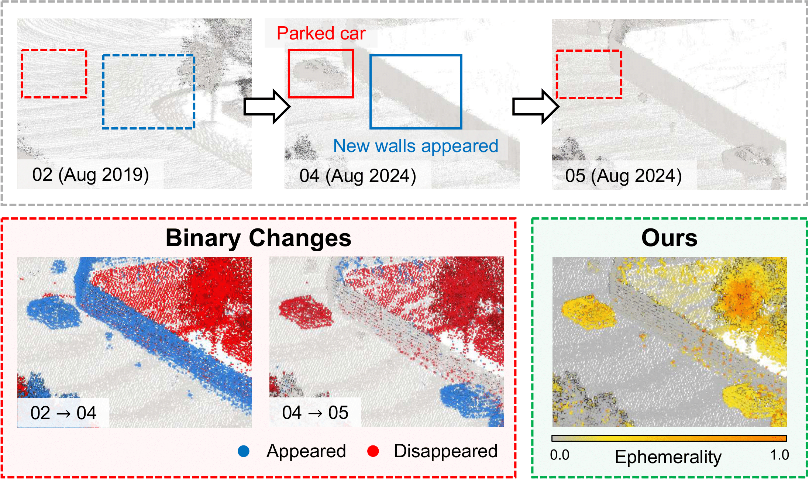
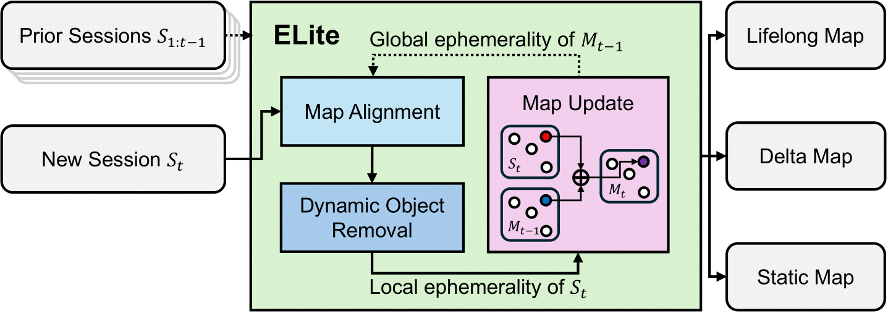

<p align="center">
  <h1 align="center">ELite: Ephemerality meets LiDAR-based Lifelong Mapping</h1>
  <p align="center">
    <a href="https://scholar.google.com/citations?hl=en&user=n15gehEAAAAJ"><strong>Hyeonjae Gil*</strong></a>
    ·
    <a href="https://scholar.google.com/citations?hl=en&user=t_5U_98AAAAJ"><strong>Dongjae Lee*</strong></a>
    ·
    <a href="https://scholar.google.com/citations?hl=en&user=9mKOLX8AAAAJ"><strong>Giseop Kim</strong></a>
    ·
    <a href="https://scholar.google.com/citations?hl=en&user=7yveufgAAAAJ"><strong>Ayoung Kim</strong></a>
  </p>
  <p align="center">(* Equal Contribution)</p>
  <!-- <h3 align="center"><a href="https://arxiv.org/abs/2502.13452">Arxiv</a> | <a href="https://arxiv.org/abs/2502.13452">Paper</a> | <a href="https://www.youtube.com/watch?v=xZwzNgcHqjc">Video</a></h3> -->
  <h3 align="center"><a href="https://arxiv.org/abs/2502.13452">Arxiv</a> | <a href="https://www.youtube.com/watch?v=xZwzNgcHqjc">Video</a></h3>
  <div align="center"></div>
</p>

<p align="center">
  
</p>

## About ELite

**ELite** is a LiDAR-based lifelong mapping framework that integrates *ephemerality*—the likelihood of a point being transient or persistent—into the entire pipeline. Unlike binary classifications of map elements (static vs. dynamic), ELite introduces a two-stage ephemerality concept to represent changes across different time scales:
- **Local ephemerality**: Captures short-term variations (e.g., moving cars vs. parked cars).
- **Global ephemerality**: Represents long-term changes (e.g., parked cars vs. new buildings)

By leveraging ephemerality, ELite seamlessly aligns multiple sessions, removes dynamic objects, and matains accurate maps.

<p align="center">
  
</p>

## Installation

### 1. Clone the repository
```bash
git clone git@github.com:dongjae0107/ELite.git
```

### 2. Set up conda environment
We tested with python 3.10, but any python version will work fine.
```bash
conda create -n elite python=3.10
conda activate elite
```

### 3. Install requirements

```bash
cd ELite
pip install -e .
```
**Optional:** For CUDA-accelerated matching, we recommend installing `pygicp` and using the `PyGICPScanMatcher`. Follow the instructions below or refer to the [fast_gicp repository](https://github.com/koide3/fast_gicp) for more details.

```bash
git clone git@github.com:koide3/fast_gicp.git
cd fast_gicp
python3 setup.py install --user
```

## Run
### Example - Parkinglot dataset
Download the dataset from this [link](https://drive.google.com/drive/folders/1D0L1jodXlzp1qVDPfdSQgE_-2IqbesyO?usp=drive_link) or use the script below to download example sequences (`01` and `02`):

```bash
bash scripts/download_parkinglot.sh
```
To download additional sequences, simply modify the script as needed.

Then, initialize the ELite with first session:
```bash
python3 run_elite.py ./config/parkinglot_first.yaml
```

For the other sessions, run:
```bash
python3 run_elite.py ./config/parkinglot.yaml
```

### Run with Your Own Dataset
#### Data preparation
You need to provide a `Session` as input. Each session must include:
- A `Scans/` folder containing point cloud files (in `.pcd` format), starting from `000000.pcd`
- A `poses.txt` file containing LiDAR poses in KITTI format

The expected directory structure is:

```
Session/
├── poses.txt
└── Scans/
    ├── 000000.pcd
    ├── 000001.pcd
    ├── ...
    └── 00000N.pcd
```

You can easily generate session data using the [saver tool](https://github.com/gisbi-kim/SC-LIO-SAM#applications) provided with [SC-LIO-SAM](https://github.com/gisbi-kim/SC-LIO-SAM).  
Alternatively, [SC-A-LOAM](https://github.com/gisbi-kim/SC-A-LOAM) and [FAST_LIO_SLAM](https://github.com/gisbi-kim/FAST_LIO_SLAM) are also supported.

#### Initial transform between sessions
To run the alignment module, you need to provide an initial transformation for the new session. Initial transformation is for coarse aligning the first few scans of new session to the previous session's coordinate frame. The simplest method is to use **ICP in CloudCompare** and use the transformation matrix. 
In near future, we are planning to automate this process by introducing global localization-based version (e.g. **Scan Context**) as written in the paper.


#### Run ELite
Once your dataset is prepared, update the parameters in `config/sample.yaml`.
Make sure to set or remove the `prev_outputs_dir` field depending on whether this is the **first session** or a **subsequent session**.

To run ELite:

```bash
python3 run_elite.py ./config/sample.yaml
```

## Citation
If you use ELite for any academic work, please cite our paper.
```bibtex
@INPROCEEDINGS { hjgil-2025-icra,
    author={Hyeonjae Gil and Dongjae Lee and Giseop Kim and Ayoung Kim},
    title={Ephemerality meets LiDAR-based Lifelong Mapping},
    booktitle={Proceedings of the IEEE International Conference on Robotics and Automation (ICRA)},
    year={2025},
    month={May.},
    address={Atlanta},
}
```

## Contact
If you have any questions, please contact:
- Hyeonjae Gil ([now9728@gmail.com]())
- Dongjae Lee ([dongjae0107@gmail.com]())

## Acknowledgement 
This work was supported by the National Research Foundation of Korea (NRF) grant funded by the Korea government (MSIT)(No. RS-2024-00461409), and in part by the Robotics and AI (RAI) Institute.